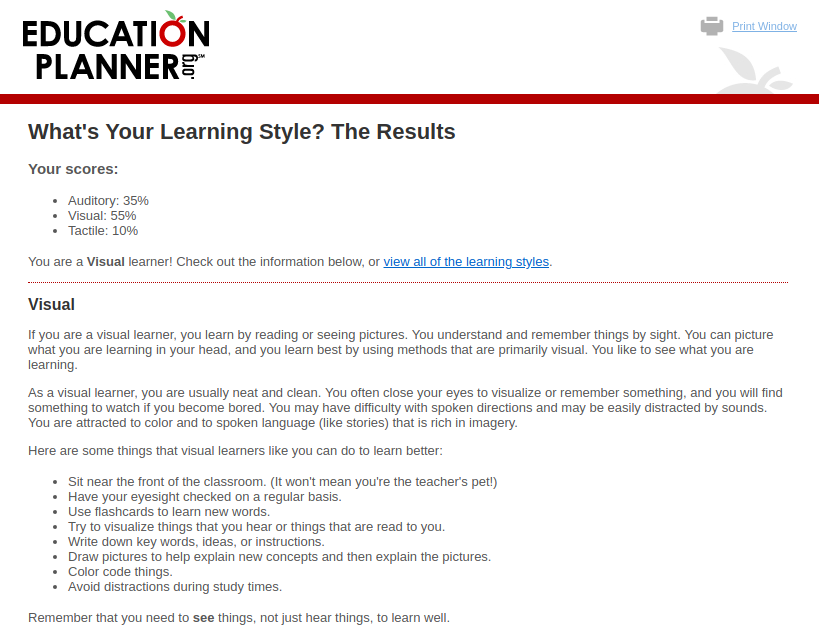
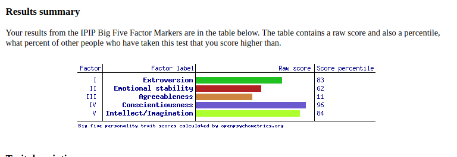

# Section 3: Personal Profile

## Test 1 - Myers-Briggs Type Indicator (MBTI)

[Source: 16Personalities Test](https://www.16personalities.com/estj-personality)

### Result: Type A, Executive

## Test 2: Learning Styles Test

[Source: Education Planner](http://www.educationplanner.org/students/self-assessments/learning-styles-results.shtml?event=results&A=7&V=11&T=2)

### Result: Visual Learner

## Big 5 Personality Test
[Source: Open Psychometrics](https://openpsychometrics.org/tests/IPIP-BFFM/results.php?r=3.9,3.2,2.9,4.7,4.5#_V)

### Results:

